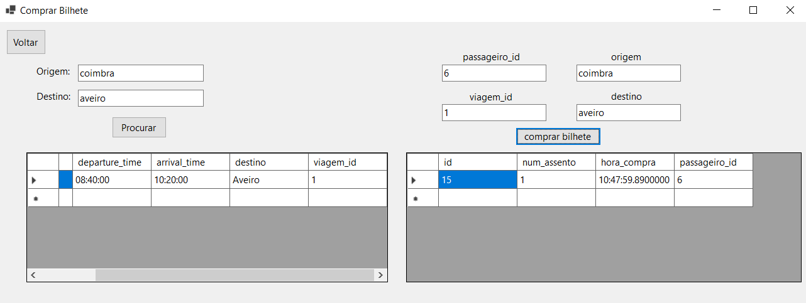

# BD: Trabalho Prático APF-T

**Grupo**: P2G2
- Alexandre Martins, MEC: 103552
- Giovanni Santos, MEC: 115637​

---

 
Neste trabalho prático, desenvolvemos um site chamado Autocarros Aveiro, que permite aos utilizadores comprar bilhetes, verificar horários e gerir informação relacionada com os transportes. O sistema também inclui funcionalidades como gerir utilizadores, condutores, passageiros e autocarros de forma manual.

## ​Análise de Requisitos / Requirements
## Entidades e Características

1. **Pessoas**
   - **Id**: Identificador único
   - **Nome**
   - **Apelido**
   - **Email**
   - **NIF**

2. **Condutor**
   - **Id** (herdado de Pessoa)
   - **Carta_Condução**
   - **Data_validade**

3. **Passageiro**
   - **Id** (herdado de Pessoa)
   - **Faixa_Etária**

4. **Terminal Rodoviário**
   - **Nome**
   - **Latitude**
   - **Longitude**

5. **Cais**
   - **Rodoviária** (referência a Terminal Rodoviário)
   - **Número**
   - **Is_Empty**

6. **Modelo_Autocarro**
   - **Id**
   - **Nome_Modelo**
   - **Marca**
   - **Ano**

7. **Autocarro**
   - **Id**
   - **Kms**
   - **Num_Lugares**
   - **Matrícula**
   - **Capacidade**
   - **Modelo** (referência a Modelo_Autocarro)

8. **Combustão**
   - **Id** (herdado de Autocarro)
   - **Cilindrada**
   - **Combustível**

9. **Elétrico**
   - **Id** (herdado de Autocarro)
   - **Autonomia**

10. **Escala**
    - **Bilhete**
    - **Num** (quantidade de vezes que terá de trocar de autocarro)
    - **Origem**
    - **Chegada**
    - **Viagem**

11. **Viagem**
    - **Id**
    - **Autocarro** (referência a Autocarro)
    - **Condutor** (referência a Condutor)

12. **Paragem**
    - **Viagem** (referência a Viagem)
    - **Ordem**
    - **Rodoviária** (referência a Terminal Rodoviário)
    - **Arrival_time**
    - **Departure_time**

13. **Bagagem**
    - **Id**
    - **Tipo**
    - **Peso**
    - **Volume**

14. **Bilhete**
    - **Id**
    - **Num_Assento**
    - **Hora_compra**
    - **Passageiro** (referência a Passageiro)

15. **Bilhete_Bagagem**
    - **Bagagem** (referência a Bagagem)
    - **Bilhete** (referência a Bilhete)
    - **Num**

## Funcionalidades do Sistema

## Sumário da Implementação

Na nossa implementação atual do frontend, focámo-nos em funcionalidades essenciais que proporcionam uma sólida experiência ao utilizador e garantem que as operações principais são geridas de forma eficiente. Optamos por não implementar completamente o CRUD no frontend para todas as entidades, visto que a avaliação do frontend não seria prioritária e, uma vez demonstrada, a capacidade de implementação já estaria evidente, evitando assim redundância.

### Funcionalidades Implementadas

#### Autenticação de Utilizador:

- **Funcionalidade de Login:** Os utilizadores podem fazer login usando um mecanismo de autenticação seguro. As passwords são armazenadas usando SHA-256 para aumentar a segurança.

#### Gestão de Pessoas:

- **Visualizar Pessoas:** Os utilizadores podem ver uma lista de pessoas e os seus tipos respetivos (Condutor ou Passageiro).
  - Para os Condutores, estão disponíveis detalhes adicionais, como a informação da carta de condução.
  - Para os Passageiros, é apresentado o grupo etário.
- **Eliminar Pessoas:** Os utilizadores podem eliminar registos de pessoas do sistema.
- **Adicionar Pessoa:** Os utilizadores podem adicionar novos passageiros e condutores ao sistema.

#### Gestão de Autocarros:

- **Visualizar Autocarros:** Os utilizadores podem ver detalhes dos autocarros, incluindo o número de lugares, quilómetros percorridos, matrícula, capacidade e modelo.
  - Os modelos de autocarros incluem informação detalhada indicando se são elétricos ou a combustão.
- **Adicionar Autocarro:** Os utilizadores podem adicionar novos autocarros ao sistema.

#### Gestão de Viagens:

- **Consultar Viagens:** Os utilizadores podem procurar viagens com base na origem e destino. Podem ver horários, incluindo horas de chegada e partida.

#### Gestão de Bilhetes:

- **Comprar Bilhete:** Os utilizadores podem comprar bilhetes, e detalhes como o número de lugar e hora da compra são registados e visualizáveis.

### Melhorias Futuras

Embora a implementação atual cubra as funcionalidades principais, futuras melhorias irão incluir:

- Operações CRUD completas para todas as entidades no diagrama ER.
- Opções avançadas de pesquisa e filtragem para uma recuperação de dados mais eficiente.
- Recursos avançados de visualização de dados e relatórios.

A estrutura atual da nossa base de dados tem stored procedures, triggers, functions, e indexes, garantindo que, mesmo à medida que expandimos estas funcionalidades, o sistema permanecerá robusto, eficiente e escalável.

## DER - Diagrama Entidade Relacionamento/Entity Relationship Diagram

### Versão final/Final version


### APFE 

Em relação à primeira entrega, o disjoint de autocarro que podia ser combustao ou eletrico foi reposicionado, sendo agora ligado ao modelo do autocarro e a cardinalidade de Bilhete e Bagagem ficou n por m.

## ER - Esquema Relacional/Relational Schema

### Versão final/Final Version


### APFE

Consequentemente as relações Combustão e Eletrico agora possuem chave referenciando a chave de Modelo_Autocarro e uma nova relação Bilhete_Bagagem.


## ​SQL DDL - Data Definition Language

[SQL DDL File](sql/01_ddl.sql "SQLFileQuestion")

## SQL DML - Data Manipulation Language

Uma secção por formulário.
A section for each form.

### Formulario exemplo/Example Form



```sql
-- Show data on the form (Bilhete após ser comprado)
private DataTable Passageiro_Bilhete(string passageiro_id)
{
    DataTable dt = new DataTable();
    string connectionString = "Data Source=DESKTOP-RGVE259;Initial Catalog=EAP;Integrated Security=True;TrustServerCertificate=True";

    using (SqlConnection conn = new SqlConnection(connectionString))
    {
        using (SqlCommand cmd = new SqlCommand("SELECT * FROM EAP.Passageiro_Bilhete(@passageiro_id)", conn))
        {
            cmd.Parameters.AddWithValue("@passageiro_id", passageiro_id);

            SqlDataAdapter da = new SqlDataAdapter(cmd);
            da.Fill(dt);
        }
    }

    return dt;
}

-- Insert new element (Comprar Bilhete)
private void button2_Click(object sender, EventArgs e)
{
    string passageiro_id = textBox8.Text;
    string viagem_id = textBox7.Text;
    string origem = textBox6.Text;
    string destino = textBox5.Text;
    //string tipoBagagem = comboBoxTipoBagagem.SelectedItem.ToString();
    //float pesoBagagem = float.Parse(textBoxPesoBagagem.Text);
    //float volumeBagagem = float.Parse(textBoxVolumeBagagem.Text);

    using (SqlConnection con = new SqlConnection(conStr))
    {
        try
        {
            con.Open();
            string queryBilhete = "EXEC EAP.ComprarBilhete @passageiro_id, @viagem_id, @origem, @destino";
            using (SqlCommand cmdBilhete = new SqlCommand(queryBilhete, con))
            {
                cmdBilhete.Parameters.AddWithValue("@passageiro_id", passageiro_id);
                cmdBilhete.Parameters.AddWithValue("@viagem_id", viagem_id);
                cmdBilhete.Parameters.AddWithValue("@origem", origem);
                cmdBilhete.Parameters.AddWithValue("@destino", destino);
                cmdBilhete.ExecuteNonQuery();
            }

            DataTable results = Passageiro_Bilhete(passageiro_id);
            dataGridView2.DataSource = results;
        }
        catch (Exception ex)
        {
            MessageBox.Show("Error! " + ex.Message);
        }
    }
}
```


## Normalização/Normalization

Ao construir o ER tivemos o cuidado de garantir a intregridade dos dados e reduzir redundâncias
Primeiro eliminamos atributos compostos, como o Nome da Pessoa, e atributos multivalor as paragens da Viagens ou escalas de um Bilhete, assim está-se na 1FN.
De seguida garantimos que não haja dependencias parciais, relações como Bilhete_Bagagem possui apenas uma atributo não chave e este depende de toda a chave (Bilhete_id, Bagagem_id) e nas relações Bilhete e Bagagem possuem os atributos que dependem respectivem apenas de suas chaves
enquanto a maioria das outras relações possuem apenas 1 chave logo os atributos dependem total da chave (2FN).
De seguida garantimos que não existem dependencias transitivas, atributos como marca e ano, ou se o autocarro é combustão ou elétrico, que dependem do modelo enquanto modelo depende do autocarro_id, foram colocados na relação de Modelo_Autocarro ao invés de Autocarro (3FN).
Por fim todos os atributos dependem de toda chave e só da chave logo paramos na BCNF.

Descreva os passos utilizados para minimizar a duplicação de dados / redução de espaço.
Justifique as opções tomadas.
Describe the steps used to minimize data duplication / space reduction.
Justify the choices made.

## Índices/Indexes

Index: Paragem (rodoviaria)
Index: Paragem (viagem_id)
Index: Modelo_autocarro (nome_modelo)
Index: Autocarro (matricula)
Index: Pessoa (email)
Index: Bilhete (num_assento)

```sql
-- Create an index to speed
create index idxParagemRodoviaria on EAP.Paragem (rodoviaria)
create index idxParagemViagem on EAP.Paragem (viagem_id)
create index idxModelo on EAP.Modelo_autocarro (nome_modelo)
create index idxAutocarroMatricula on EAP.Autocarro (matricula)
create index idxPessoaEmail on EAP.Pessoa (email)
create index idxBilheteAssento on EAP.Bilhete (num_assento)
```

## SQL Programming: Stored Procedures, Triggers, UDF

[SQL SPs and Functions File](sql/02_sp_functions.sql "SQLFileQuestion")

[SQL Triggers File](sql/03_triggers.sql "SQLFileQuestion")

## Outras notas/Other notes

### Dados iniciais da dabase de dados/Database init data

[Indexes File](sql/01_ddl.sql "SQLFileQuestion")

### Apresentação

[Slides](slides.pdf "Sildes")

[Video](video.mp4)  


 