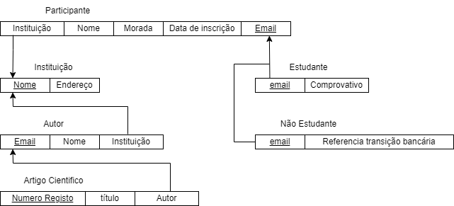

# BD: Guião 3


## ​Problema 3.1
 
### *a)*

```
Cliente(NIF(PK), nome, endereco, num_carta)

Aluguer(número(PK), duracao, data, Cliente_NIF(FK), Balcao_numero(FK), Veiculo_matricula(FK))

Balcao(nome, número(PK), endereco)

Veiculo(matrícula(PK), marca, ano, TipoDeVeiculo_codigo(FK))

Tipo_Veiculo(codigo(PK),designacao,arcondicionado)

Ligeiro(numlugares,portas,combustivel,TipoDeVeiculo_codigo(FK)(PK))

Pesado(peso,passageiros,TipoDeVeiculo_codigo(FK)(PK))

Similaridade(codigo1(FK)(PK),codigo2(FK)(PK))

```


### *b)* 


```
chaves candidatas:
- Cliente(NIF,num_carta)
- Aluguer(número)
- Balcao(número)
- Veiculo(matrícula)
- Tipo_Veiculo(codigo)
- Ligeiro(codigo)
- Pesado(codigo)
- Similaridade({codigo1,codigo2})

chaves primárias:
- Cliente(NIF)
- Aluguer(número)
- Balcao(número)
- Veiculo(matrícula)
- Tipo_Veiculo(codigo)
- Ligeiro(TipoDeVeiculo_codigo)
- Pesado(TipoDeVeiculo_codigo)
- Similaridade({codigo1,codigo2})

chaves estrangeiras:
- Aluguer(Cliente_NIF, Balcao_numero, Veiculo_matricula)
- Veiculo(TipoDeVeiculo_codigo)
- Similaridade(codigo1, codigo2)
- Ligeiro(TipoDeVeiculo_codigo)
- Pesado(TipoDeVeiculo_codigo)
```


### *c)* 


## ​Problema 3.2

### *a)*

```
Airport(Airport_code(PK), City, State, Name)

Can_Land(Airport_code(FK)(PK),Airplane_type(FK)(PK))

Airplane_Type(Type_name(PK),Max_seats,Company)

Airplane(Airplane_id(PK),Total_no_of_seats,Airplane_type(FK))

Flight(Number(PK),Airline,Weekdays)

Fare(Number(FK)(PK),Code(PK),Restrictions,Amount)

Flight_Leg(Number(FK)(PK),Leg_no(PK),Departure_Airport(FK),Scheduled_dep_time, Arrival_Airport(FK), Scheduled_arr_time)

Leg_Instance(Number(FK)(PK),Leg_no(FK)(PK),Date(PK),No_of_avail_seats,Airplane_id(FK), Airport_Departs(FK), Dep_time, Airport_Arrives(FK), Arr_time)

Seat(Number(FK)(PK), Leg_no(FK)(PK), Date(FK)(PK), Seat_no(PK), Customer_name, Cphone)

```


### *b)* 

```
chaves candidatas:  
- Airport(Airport_code,Name)
- Can_Land(Airport_code,Airplane_type)
- Airplane_Type(Type_name)
- Airplane(Airplane_id)
- Flight(Number)
- Fare(Number,Code)
- Flight_Leg(Number,Leg_no)
- Leg_Instance(Number,Leg_no,Date)
- Seat(Number, Leg_no, Date, Seat_no)

chaves primárias:
- Airport(Airport_code)
- Can_Land({Airport_code,Airplane_type})
- Airplane_Type(Type_name)
- Airplane(Airplane_id)
- Flight(Number)
- Fare({Number,Code})
- Flight_Leg({Number,Leg_no})
- Leg_Instance({Number,Leg_no,Date})
- Seat({Number, Leg_no, Date, Seat_no})

chaves estrangeiras:
- Can_Land(Airport_code,Airplane_type)
- Airplane(Airplane_type)
- Fare(Number)
- Flight_Leg(Number,Departure_Airport,Arrival_Airport)
- Leg_Instance(Number,Leg_no,Airplane_id,Airport_Departs,Airport_Arrives)
- Seat(Number, Leg_no, Date)
```


### *c)* 


## ​Problema 3.3


### *a)* 2.1


### *b)* 2.2


### *c)* 2.3



### *d)* 2.4

