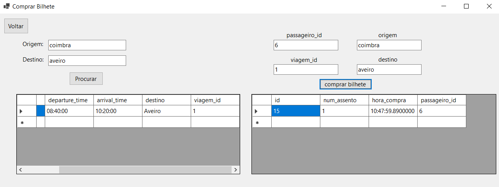

# BD: Trabalho Prático APF-T

**Grupo**: P2G2
- Alexandre Martins, MEC: 103552
- Giovanni Santos, MEC: 115637​

---

 
Neste trabalho prático, desenvolvemos um site chamado Autocarros Aveiro, que permite aos utilizadores comprar bilhetes, verificar horários e gerir informação relacionada com os transportes. O sistema também inclui funcionalidades como gerir utilizadores, condutores, passageiros e autocarros de forma manual.

## ​Análise de Requisitos / Requirements

## DER - Diagrama Entidade Relacionamento/Entity Relationship Diagram

### Versão final/Final version


### APFE 

Em relação à primeira entrega, o disjoint de autocarro que podia ser combustao ou eletrico foi reposicionado, sendo agora ligado ao modelo do autocarro

## ER - Esquema Relacional/Relational Schema

### Versão final/Final Version


### APFE


## ​SQL DDL - Data Definition Language

[SQL DDL File](sql/01_ddl.sql "SQLFileQuestion")

## SQL DML - Data Manipulation Language

Uma secção por formulário.
A section for each form.

### Formulario exemplo/Example Form



```sql
-- Show data on the form (Bilhete após ser comprado)
private DataTable Passageiro_Bilhete(string passageiro_id)
{
    DataTable dt = new DataTable();
    string connectionString = "Data Source=DESKTOP-RGVE259;Initial Catalog=EAP;Integrated Security=True;TrustServerCertificate=True";

    using (SqlConnection conn = new SqlConnection(connectionString))
    {
        using (SqlCommand cmd = new SqlCommand("SELECT * FROM EAP.Passageiro_Bilhete(@passageiro_id)", conn))
        {
            cmd.Parameters.AddWithValue("@passageiro_id", passageiro_id);

            SqlDataAdapter da = new SqlDataAdapter(cmd);
            da.Fill(dt);
        }
    }

    return dt;
}

-- Insert new element (Comprar Bilhete)
private void button2_Click(object sender, EventArgs e)
{
    string passageiro_id = textBox8.Text;
    string viagem_id = textBox7.Text;
    string origem = textBox6.Text;
    string destino = textBox5.Text;
    //string tipoBagagem = comboBoxTipoBagagem.SelectedItem.ToString();
    //float pesoBagagem = float.Parse(textBoxPesoBagagem.Text);
    //float volumeBagagem = float.Parse(textBoxVolumeBagagem.Text);

    using (SqlConnection con = new SqlConnection(conStr))
    {
        try
        {
            con.Open();
            string queryBilhete = "EXEC EAP.ComprarBilhete @passageiro_id, @viagem_id, @origem, @destino";
            using (SqlCommand cmdBilhete = new SqlCommand(queryBilhete, con))
            {
                cmdBilhete.Parameters.AddWithValue("@passageiro_id", passageiro_id);
                cmdBilhete.Parameters.AddWithValue("@viagem_id", viagem_id);
                cmdBilhete.Parameters.AddWithValue("@origem", origem);
                cmdBilhete.Parameters.AddWithValue("@destino", destino);
                cmdBilhete.ExecuteNonQuery();
            }

            DataTable results = Passageiro_Bilhete(passageiro_id);
            dataGridView2.DataSource = results;
        }
        catch (Exception ex)
        {
            MessageBox.Show("Error! " + ex.Message);
        }
    }
}
```


## Normalização/Normalization

Descreva os passos utilizados para minimizar a duplicação de dados / redução de espaço.
Justifique as opções tomadas.
Describe the steps used to minimize data duplication / space reduction.
Justify the choices made.

## Índices/Indexes

Descreva os indices criados. Junte uma cópia do SQL de criação do indice.
Describe the indexes created. Attach a copy of the SQL to create the index.

```sql
-- Create an index to speed
CREATE INDEX index_name ON table_name (column1, column2, ...);
```

## SQL Programming: Stored Procedures, Triggers, UDF

[SQL SPs and Functions File](sql/02_sp_functions.sql "SQLFileQuestion")

[SQL Triggers File](sql/03_triggers.sql "SQLFileQuestion")

## Outras notas/Other notes

### Dados iniciais da dabase de dados/Database init data

[Indexes File](sql/01_ddl.sql "SQLFileQuestion")

### Apresentação

[Slides](slides.pdf "Sildes")

[Video](video.mp4)  


 